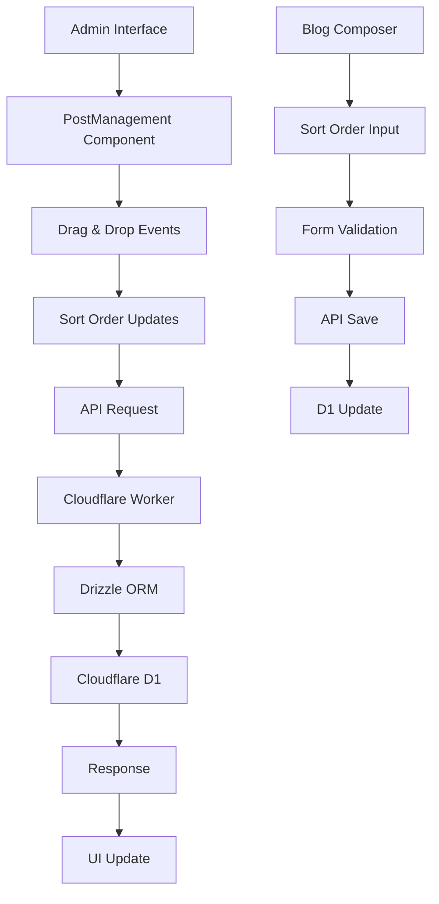

# Design Document

## Overview

The Blog Composer Sort Order Use feature implements comprehensive sort order functionality for blog posts in the Black Living e-commerce platform. This feature enables content creators to manually control the display order of blog posts through drag-and-drop reordering and manual sort order input, while maintaining a three-layer sorting system that prioritizes manually ordered content over system-sorted content.

## Steering Document Alignment

### Technical Standards (tech.md)
- **TypeScript 5.x**: All new code will use strict TypeScript with proper type definitions
- **React 19.x**: Component development follows React best practices with hooks
- **Tailwind CSS**: Utility-first styling with consistent design tokens
- **Drizzle ORM**: Database operations use type-safe queries
- **Cloudflare D1**: SQLite-compatible database for data persistence
- **Astro.js**: Server-side rendering for optimal performance

### Project Structure (structure.md)
- **Modular Components**: Sort order logic separated from core post functionality
- **Feature-based Organization**: Related components and utilities grouped together
- **Type Safety**: Comprehensive TypeScript interfaces for all data structures
- **Consistent Naming**: kebab-case for files, PascalCase for components
- **Import Patterns**: Barrel exports for clean public APIs

## Code Reuse Analysis

### Existing Components to Leverage

- **BlogComposer** (`apps/admin/app/components/BlogComposer.tsx`): Admin form component to extend with sort order field
- **PostManagement** (`apps/admin/app/components/PostManagement.tsx`): Posts list component using TanStack Table to extend with drag-and-drop sorting
- **TanStack Table**: Existing table library that supports row reordering with dnd-kit integration
- **UI Components** (`packages/ui/`): Button, Input, Select, Dialog components for admin interface
- **Database Schema** (`packages/db/schema.ts`): Posts table already includes sortOrder field

### Integration Points

- **Database Schema** (`packages/db/schema.ts`): Extend posts table sortOrder field usage
- **API Routes** (`apps/api/src/routes/`): Update posts CRUD operations to handle three-layer sorting
- **Type Definitions** (`packages/types/`): Extend blog post types with sort order properties
- **Admin Dashboard** (`apps/admin/`): Integrate sort order controls and drag-and-drop functionality

## Architecture

### Component Architecture

```mermaid
graph TD
    A[PostManagement (Modified)] --> B[TanStack Table + dnd-kit]
    B --> C[DragHandle Component]
    B --> D[SortOrder Column]

    E[BlogComposer] --> F[SortOrderField]
    F --> G[SortOrderInput]
    F --> H[SortOrderValidation]

    I[API Layer] --> J[PostsController]
    J --> K[ThreeLayerSorting]
    K --> L[D1QueryBuilder]
```

### Data Flow Architecture



## Components and Interfaces

### SortOrderField Component (New)

**Purpose:** Form field component for sort order input in blog composer
**Location:** `apps/admin/app/components/SortOrderField.tsx`

**Props:**
```typescript
interface SortOrderFieldProps {
  value: number;
  onChange: (value: number) => void;
  error?: string;
  disabled?: boolean;
}
```

**Key Methods:**
- `validateSortOrder()`: Client-side validation for sort order input
- `formatSortOrder()`: Display formatting for sort order values

### DragHandle Component (New)

**Purpose:** Visual drag handle and activation point for dnd-kit drag operations
**Location:** `apps/admin/app/components/DragHandle.tsx`

**Props:**
```typescript
interface DragHandleProps {
  isDragging?: boolean;
  disabled?: boolean;
  // dnd-kit integration props
  listeners?: any;
  attributes?: any;
}
```

**Key Features:**
- Visual drag indicator (three dots/grip icon)
- Integration with dnd-kit's drag activation
- Proper ARIA attributes for accessibility
- Visual feedback during drag operations

## Data Models

### Extended BlogPost Model

```typescript
interface BlogPost {
  // Existing fields...
  id: string;
  title: string;
  slug: string;
  description: string;
  content: string;
  // ... other existing fields

  // Sort order field (already exists in schema)
  sortOrder: number; // Default: 0

  // Metadata
  createdAt: Date;
  updatedAt: Date;
}
```

### SortOrderUpdate Model

```typescript
interface SortOrderUpdate {
  postId: string;
  sortOrder: number;
  updatedAt: Date;
}

interface BatchSortOrderUpdate {
  updates: SortOrderUpdate[];
  updatedBy: string;
}
```

## Error Handling

### Error Scenarios

1. **Drag & Drop Operation Failure:**
   - **Handling:** Revert UI to previous state, show error notification
   - **User Impact:** Visual feedback with clear error message

2. **Sort Order Validation Failure:**
   - **Handling:** Form validation with inline error messages
   - **User Impact:** Cannot save invalid sort order values

3. **API Update Failure:**
   - **Handling:** Rollback optimistic updates, show retry option
   - **User Impact:** Temporary UI inconsistency resolved automatically

4. **Concurrent Edit Conflict:**
   - **Handling:** Server-side conflict detection with merge resolution
   - **User Impact:** Clear notification of conflicting changes

## Testing Strategy

### Unit Testing
- **PostManagement Component (Modified):** Test drag-and-drop event handling and sort order updates
- **SortOrderField Component:** Test input validation and formatting
- **DragHandle Component:** Test dnd-kit integration and accessibility features
- **API Sorting Logic:** Test three-layer sorting algorithm
- **Utility Functions:** Test sort order calculation and validation helpers

### Integration Testing
- **Drag & Drop Workflow:** Test complete reorder operation from UI to database
- **Form Submission:** Test sort order saving in blog composer
- **API Integration:** Test sorted data retrieval and updates

### End-to-End Testing
- **Admin Sort Order Management:** Create, edit, and reorder posts
- **Data Persistence:** Verify sort orders survive page refreshes
- **Multi-user Scenarios:** Test concurrent editing scenarios

## Implementation Plan

### Phase 1: Database & API Foundation
1. Verify existing sortOrder field in posts table schema
2. Update API routes to implement three-layer sorting logic
3. Add sort order validation in API endpoints
4. Create database migration if needed (though field already exists)

### Phase 2: Admin Interface - Sort Order Input
1. Add SortOrderField component to BlogComposer
2. Integrate form validation for sort order input
3. Update blog post form submission to handle sort order
4. Add sort order display in post management table

### Phase 3: Drag & Drop Sorting Implementation
1. Modify PostManagement component to integrate dnd-kit with TanStack Table
2. Add DragHandle component for visual drag indicators
3. Implement drag-and-drop event handling and sort order updates
4. Add batch sort order update functionality via new API endpoint
5. Integrate optimistic UI updates with error handling

### Phase 4: Integration & Testing
1. End-to-end testing of complete sort order workflow
2. Performance testing for drag-and-drop operations
3. Accessibility testing for keyboard navigation
4. Cross-browser compatibility testing

## Database Schema Changes

The posts table already includes the sortOrder field:

```sql
sortOrder: integer('sort_order').default(0), // For manual ordering
```

### Index Optimization

Add database index for efficient sorting queries:

```sql
-- Composite index for three-layer sorting
CREATE INDEX idx_posts_sort_order ON posts(sort_order = 0, sort_order, updated_at DESC);

-- Additional index for admin queries
CREATE INDEX idx_posts_admin_sort ON posts(status, sort_order = 0, sort_order, updated_at DESC);
```

## API Changes

### GET /api/posts (Admin)

**Current:** Returns posts without specific ordering
**Updated:** Returns posts with three-layer sorting applied

**Query Logic:**
```sql
ORDER BY (sort_order = 0), sort_order ASC, updated_at DESC
```

### POST /api/posts (Create)

**Current:** Creates post with default sortOrder = 0
**Updated:** Accepts sortOrder in request body, defaults to 0

### PUT /api/posts/:id (Update)

**Current:** Updates post fields
**Updated:** Includes sortOrder validation and update

### New Endpoint: POST /api/posts/batch-sort-order

**Purpose:** Batch update sort orders after drag-and-drop operations

**Request Body:**
```json
{
  "updates": [
    { "postId": "uuid", "sortOrder": 1 },
    { "postId": "uuid", "sortOrder": 2 }
  ]
}
```

## UI/UX Considerations

### Drag & Drop Visual Feedback
- Highlight drop zones during drag operations
- Show drag preview with semi-transparent styling
- Display loading states during sort order updates
- Provide clear error states with retry options

### Sort Order Input Design
- Clear labeling: "排序順序" with helper text
- Default value display: "0 (自動排序)"
- Input validation with real-time feedback
- Consistent styling with existing form fields

### Accessibility Features
- Keyboard navigation for drag-and-drop operations
- Screen reader announcements for sort order changes
- High contrast visual indicators for drag states
- Alternative text for all interactive elements
