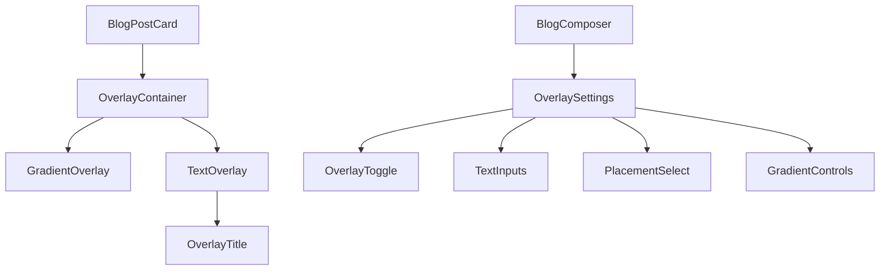
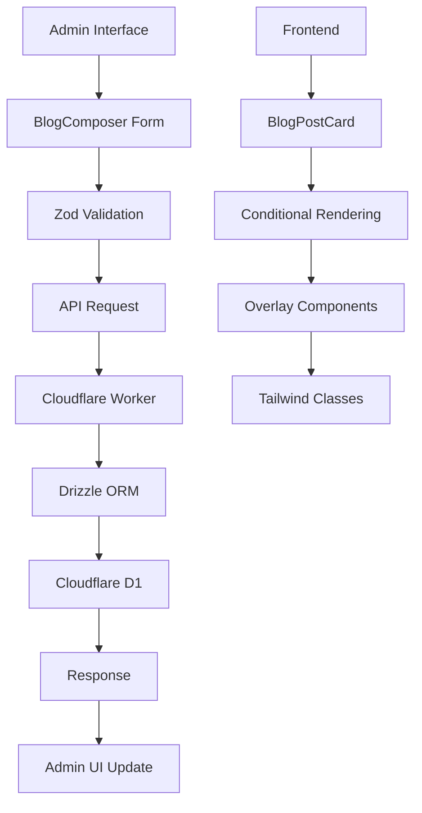

# Design Document

## Overview

The Card Component Overlay feature enhances the existing BlogPostCard component with configurable text and gradient overlays. This feature allows content creators to add compelling overlay text directly on blog post card images through an admin interface, improving visual hierarchy and user engagement while maintaining the existing card layout and functionality.

## ⚠️ Important Notice

**Component Design Preservation**: The existing BlogPostCard component design must be kept intact. Only the `horizontal` variant will be enhanced with overlay functionality. The `vertical` variant remains unchanged and is out of scope for this refactor.

**Scope Limitation**: This feature focuses exclusively on the horizontal card layout. Any changes to the vertical variant are not permitted in this implementation.

## Steering Document Alignment

### Technical Standards (tech.md)
- **TypeScript 5.x**: All new code will use strict TypeScript with proper type definitions
- **React 19.x**: Component development follows React best practices with hooks
- **Tailwind CSS**: Utility-first styling with consistent design tokens
- **Drizzle ORM**: Database operations use type-safe queries
- **Cloudflare D1**: SQLite-compatible database for data persistence
- **Astro.js**: Server-side rendering for optimal performance

### Project Structure (structure.md)
- **Modular Components**: Overlay logic separated from core card functionality
- **Feature-based Organization**: Related components and utilities grouped together
- **Type Safety**: Comprehensive TypeScript interfaces for all data structures
- **Consistent Naming**: kebab-case for files, PascalCase for components
- **Import Patterns**: Barrel exports for clean public APIs

## Code Reuse Analysis

### Existing Components to Leverage

- **BlogPostCard** (`apps/web/src/components/BlogPostCard.tsx`): Core card component to extend with overlay functionality
- **BlogComposer** (`apps/admin/app/components/BlogComposer.tsx`): Admin form component to extend with overlay settings
- **UI Components** (`packages/ui/`): Button, Input, Select, Switch, Card components for admin interface

### Integration Points

- **Database Schema** (`packages/db/schema.ts`): Extend posts table with overlay fields
- **API Routes** (`apps/api/src/routes/`): Update posts CRUD operations to handle overlay data
- **Type Definitions** (`packages/types/`): Extend blog post types with overlay properties
- **Admin Dashboard** (`apps/admin/`): Integrate overlay settings into blog composer workflow

## Architecture

### Component Architecture



### Data Flow Architecture



## Components and Interfaces

### BlogPostCard Component (Enhanced)

**Purpose:** Display blog post cards with optional overlay text and gradients
**Location:** `apps/web/src/components/BlogPostCard.tsx`

**New Props:**
```typescript
interface BlogPostCardProps {
  post: BlogPost & {
    overlayEnabled?: boolean;
    overlayTitle?: string;
    overlayPlacement?: 'bottom-left' | 'bottom-right' | 'top-left' | 'center';
    overlayGradientDirection?: string;
  };
  variant?: 'vertical' | 'horizontal';
  className?: string;
  href: string;
}
```

**Key Methods:**
- `renderOverlay()`: Conditionally render overlay components
- `getOverlayClasses()`: Generate Tailwind classes based on placement
- `getGradientClasses()`: Generate gradient background classes

### OverlayContainer Component (New)

**Purpose:** Container component for overlay elements with positioning logic
**Location:** `apps/web/src/components/OverlayContainer.tsx`

**Props:**
```typescript
interface OverlayContainerProps {
  placement: 'bottom-left' | 'bottom-right' | 'top-left' | 'center';
  children: React.ReactNode;
  className?: string;
}
```

### BlogComposer Overlay Section (New)

**Purpose:** Admin interface for configuring overlay settings
**Location:** `apps/admin/app/components/BlogComposer.tsx` (extended)

**Form Fields:**
- `overlayEnabled`: Boolean switch (controls both text and gradient overlay)
- `overlayTitle`: Text input (max 50 chars, single line)
- `overlayPlacement`: Select dropdown
- `overlayGradientDirection`: Select dropdown

## Data Models

### Extended BlogPost Model

```typescript
interface BlogPost {
  // Existing fields...
  id: string;
  title: string;
  slug: string;
  description: string;
  content: string;
  excerpt?: string;
  authorId?: string;
  authorName?: string;
  status: 'draft' | 'published' | 'scheduled' | 'archived';
  featured: boolean;
  categoryId?: string;
  category: string;
  tags: string[];
  featuredImage?: string;
  // SEO fields...
  // Publishing fields...
  // Analytics fields...
  // Settings...

  // New overlay fields
  overlayEnabled: boolean;
  overlayTitle?: string;
  overlayPlacement: 'bottom-left' | 'bottom-right' | 'top-left' | 'center';
  overlayGradientDirection: string;

  createdAt: Date;
  updatedAt: Date;
}
```

### Database Schema Extension

**Posts Table Additions:**
```sql
-- Overlay Settings (JSON object for all overlay configuration)
overlay_settings TEXT DEFAULT '{}',        -- JSON object containing all overlay settings
```

**Overlay Settings JSON Structure:**
```json
{
  "enabled": false,           // 啟用疊加文字與漸層
  "title": "探索更多",        // 疊加標題 (max 50 chars)
  "placement": "bottom-left", // 位置設定
  "gradientDirection": "b"    // 漸層方向
}
```

## Error Handling

### Validation Errors
1. **Text Length Exceeded:** When overlay text exceeds character limits
   - **Handling:** Form validation with Zod schema
   - **User Impact:** Inline error messages with character counts

2. **Invalid Placement Value:** When placement value is not in allowed set
   - **Handling:** Select dropdown with predefined options
   - **User Impact:** No invalid values possible through UI

### Runtime Errors
1. **Missing Overlay Data:** When post data doesn't include overlay fields
   - **Handling:** Default values and optional chaining
   - **User Impact:** Graceful fallback to no overlay

2. **CSS Class Generation Failure:** When Tailwind classes can't be generated
   - **Handling:** Fallback to safe default classes
   - **User Impact:** Overlay still renders with basic styling

## Testing Strategy

### Unit Testing
- **BlogPostCard Component:** Test overlay rendering with different placements
- **OverlayContainer Component:** Test positioning logic and class generation
- **Form Validation:** Test Zod schema validation for overlay fields
- **Utility Functions:** Test gradient and text positioning helpers

### Integration Testing
- **Admin Form Submission:** Test complete overlay settings save flow
- **API Integration:** Test overlay data persistence and retrieval
- **Component Integration:** Test BlogPostCard with overlay props

### End-to-End Testing
- **Admin Workflow:** Create/edit post with overlay settings
- **Frontend Display:** Verify overlay renders correctly on blog listing pages
- **Responsive Behavior:** Test overlay positioning across breakpoints

## Implementation Plan

### Phase 1: Database & API (Foundation)
1. Extend posts table schema with overlay fields
2. Update Drizzle ORM types
3. Modify API routes to handle overlay data
4. Add validation for overlay fields

### Phase 2: Admin Interface (Configuration)
1. Extend BlogComposer form with overlay section
2. Add Zod validation for overlay fields
3. Implement conditional UI (show/hide based on overlayEnabled)
4. Add form submission handling

### Phase 3: Frontend Components (Display)
1. Extend BlogPostCard component with overlay props
2. Create OverlayContainer component
3. Implement overlay rendering logic
4. Add responsive styling and positioning

### Phase 4: Integration & Testing (Quality)
1. End-to-end testing of complete workflow
2. Performance testing for overlay rendering
3. Accessibility testing for overlay text
4. Cross-browser compatibility testing
