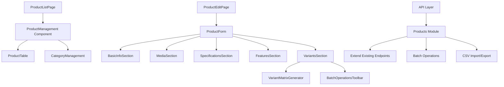

# Admin Accessory Product Management Design

## Overview

This feature extends the Black Living admin backend to support comprehensive accessory-type product management. The implementation adds new UI components, API endpoints, and database operations while maintaining minimal changes to existing schema. The design focuses on creating a dedicated product edit page to replace modal-heavy interactions, implementing product type templates, and supporting batch operations for efficient accessory management.

## Steering Document Alignment

### Technical Standards (tech.md)
The design follows established Black Living technical patterns:
- **TypeScript 5.x** for all new code with strict type checking
- **React 19.x** with modern hooks and functional components
- **Hono 4.x** for new API endpoints following existing route patterns
- **Drizzle ORM** for database operations with existing query patterns
- **Zod schemas** for validation following existing product schema structure
- **Tailwind CSS** with Shadcn UI components for consistent styling

### Project Structure (structure.md)
The implementation follows the established monorepo structure:
- **Admin routes** in `apps/admin/app/routes/dashboard/` for new product edit page
- **API modules** in `apps/api/src/modules/` extending existing products module
- **Shared components** in `packages/ui/` for reusable accessory-specific components
- **Database schemas** already extended in `packages/db/schema.ts`
- **Type definitions** in `packages/types/` for new accessory-related types

## Code Reuse Analysis

### Existing Components to Leverage

- **ProductManagement.tsx**: Large existing component (1000+ lines) handling product CRUD in modals - will be refactored to extract shared logic and reduce to <500 lines as specified in requirements
- **ImageUpload component**: Existing image upload functionality for product images
- **React Table**: Existing table implementation with sorting, filtering, and pagination
- **Shadcn UI components**: Button, Dialog, Select, Input, Textarea, Badge, Switch components
- **Zod validation**: Existing product validation patterns extended for accessory fields

### Integration Points

- **Database Schema**: Products table already includes `accessoryType`, `parentProductId`, and `featuresMarkdown` fields
- **API Layer**: Extend existing `/api/products` endpoints (same route family) to accept accessory fields and `featuresMarkdown`; protect mutating routes with admin guard
- **Admin UI**: Integrate new dedicated edit page with existing dashboard navigation
- **Frontend**: Update product display logic to handle `featuresMarkdown` with fallback to `features[]`

## Architecture

### Modular Design Principles

The design follows single responsibility principles with clear separation of concerns:

- **Product Edit Page** (`/dashboard/products/{id}/edit`): Dedicated page component handling complex product editing
- **Accessory Components**: Specialized components for variant matrix generation, batch operations, and template selection
- **API Extensions**: New endpoints integrated into existing products module
- **Validation Layer**: Extended Zod schemas for accessory-specific validation
- **Service Layer**: Business logic separated from UI components

### Component Architecture



## Components and Interfaces

### Product Edit Page (`/dashboard/products/{id}/edit`)

**Purpose:** Dedicated page for complex product editing, replacing modal-based approach.

**Interfaces:**
```typescript
interface ProductEditPageProps {
  productId?: string; // undefined for new products
  mode: 'create' | 'edit';
}

interface ProductFormData {
  // Existing fields...
  accessoryType: 'standalone' | 'accessory' | 'bundle';
  parentProductId?: string;
  featuresMarkdown: string;
  // Extended variant structure
  variants: Array<{
    id: string;
    name: string;
    price: number;
    sku: string;
    size?: string;
    color?: string;
    weight?: string;
    thickness?: string;
    loft?: string;
    stock: number;
    active: boolean;
  }>;
}

**Features Section (Markdown):**

- Editor: Use existing `BlockNoteEditor` component to edit `featuresMarkdown` as rich text
- Storage: Persist markdown string to `products.features_markdown` (preferred over `features[]`)
- Fallback: If `featuresMarkdown` is empty, UI may render legacy `features[]` as a simple list
```

**Dependencies:** React Router for routing, Zod + controlled form state (consistent with existing code), existing API services.

### Variant Matrix Generator Component

**Purpose:** Automatically generates product variants from selected option combinations.

**Interfaces:**
```typescript
interface VariantMatrixProps {
  productType: ProductType;
  options: ProductOptions;
  onVariantsGenerated: (variants: Variant[]) => void;
  onExcludeVariants: (variantIds: string[]) => void;
}

interface ProductOptions {
  size?: string[];
  color?: string[];
  weight?: string[];
  thickness?: string[];
  loft?: string[];
  firmness?: string[];
}
```

**Reuses:** Existing option selection UI patterns, SKU generation logic.

### Batch Operations Toolbar

**Purpose:** Provides bulk editing capabilities for pricing, inventory, and images.

**Interfaces:**
```typescript
interface BatchOperationsProps {
  selectedVariants: string[];
  onBatchUpdate: (updates: BatchUpdate) => void;
}

interface BatchUpdate {
  mode: 'overwrite' | 'fill-empty' | 'increment';
  field: 'price' | 'stock' | 'images';
  value: any;
  differentialPricing?: Record<string, number>; // For option-based price adjustments
}
```

**Reuses:** Existing modal patterns, form validation logic.

### Product Type Templates

**Purpose:** Provides predefined templates for different accessory categories.

**Interfaces:**
```typescript
interface ProductTypeTemplate {
  type: ProductType;
  axes: VariantAxis[];
  defaultOptions: Record<string, string[]>;
  requiredFields: string[];
  optionalFields: string[];
}

type ProductType = 'mattress' | 'protector' | 'sheet-set' | 'pillow' | 'duvet' | 'topper' | 'adjustable-base' | 'other';

type VariantAxis = 'size' | 'color' | 'weight' | 'thickness' | 'loft' | 'firmness';
```

## Data Models

### Extended Product Model

```typescript
interface Product {
  // Existing fields...
  accessoryType: 'standalone' | 'accessory' | 'bundle';
  parentProductId?: string;
  featuresMarkdown: string; // Preferred over features[]
  features: string[]; // Backward compatibility

  // Enhanced variants with accessory-specific fields
  variants: Array<{
    id: string;
    name: string;
    price: number;
    sku: string;
    barcode?: string;
    size?: string;
    color?: string;
    weight?: string;
    thickness?: string;
    loft?: string;
    firmness?: string;
    stock: number;
    active: boolean;
    images: string[]; // Variant-specific images
  }>;
}

### Validation Rules (Application Level)

- `accessoryType` must be one of: `'standalone' | 'accessory' | 'bundle'`
- If `accessoryType === 'accessory'`, then `parentProductId` is required and must reference an existing product (no self-reference)
- Prevent cycles for accessories at the application layer (simple ancestor check)
- `featuresMarkdown` takes precedence over `features[]` when both are present
```

### Approval Workflow Model

```typescript
interface ProductApproval {
  id: string;
  productId: string;
  status: 'draft' | 'in_review' | 'published' | 'archived';
  requestedBy: string;
  approvedBy?: string;
  approvedAt?: Date;
  changes: FieldChange[]; // For audit logging
}

interface FieldChange {
  field: string;
  oldValue: any;
  newValue: any;
  timestamp: Date;
}
```

## Error Handling

### Error Scenarios

1. **Invalid Product Type Template**
   - **Handling:** Display clear error message with valid options
   - **User Impact:** Form validation prevents submission with invalid templates

2. **SKU Uniqueness Violation**
   - **Handling:** Validate uniqueness on blur and submission, suggest alternatives
   - **User Impact:** Inline validation with suggested SKU formats

3. **Batch Operation Conflicts**
   - **Handling:** Preview changes before applying, allow rollback
   - **User Impact:** Confirmation dialog with affected variant count

4. **CSV Import Errors**
   - **Handling:** Detailed error reporting with row numbers and fix suggestions
   - **User Impact:** Downloadable error report with corrected template

## Testing Strategy

### Unit Testing
- **Component Testing:** ProductEditPage, VariantMatrixGenerator, BatchOperationsToolbar
- **Utility Testing:** SKU generation, template validation, CSV parsing
- **API Testing:** New endpoints for accessory operations

### Integration Testing
- **Form Workflows:** Complete product creation with variants and batch operations
- **API Integration:** CRUD operations with database state verification
- **Template Application:** Product type template selection and variant generation

### End-to-End Testing
- **Admin Workflows:** Complete product management scenarios from creation to publishing
- **Batch Operations:** Large-scale variant updates and CSV import/export
- **Approval Workflow:** Status transitions and audit logging

## Implementation Plan

### Phase 1: Core Infrastructure
1. Extend Zod schemas for accessory fields and `featuresMarkdown`
2. Create product type templates configuration
3. Implement SKU generation utilities
4. Extend existing products module endpoints to accept new fields (no new route family)

### Phase 2: UI Components
1. Create dedicated ProductEditPage component
2. Implement VariantMatrixGenerator component
3. Build BatchOperationsToolbar component
4. Refactor ProductManagement.tsx to reduce complexity
5. Integrate `BlockNoteEditor` into Features section (save to `featuresMarkdown`)

### Phase 3: Integration & Testing
1. Integrate new components with existing admin UI
2. Implement approval workflow UI
3. Add CSV import/export functionality
4. Comprehensive testing and validation

### Phase 4: Optimization & Polish
1. Performance optimization for large variant matrices
2. Enhanced error handling and user feedback
3. Accessibility improvements
4. Documentation updates

## Decisions & Constraints

- Forms: Use Zod + controlled form state (no React Hook Form) to stay consistent with existing admin code
- Editor: Use `BlockNoteEditor` for `featuresMarkdown`; retain `features[]` for backward compatibility and fallback
- API: Keep `/api/products` route family; add optional fields (`featuresMarkdown`, `accessoryType`, `parentProductId`) to create/update; guard mutations with admin middleware
- Migrations: Use drizzle-kit to generate migrations (e.g., `features_markdown` and accessory fields). Avoid manual SQL
- Indexing: Defer indexes for accessory queries unless performance requires them (YAGNI)
