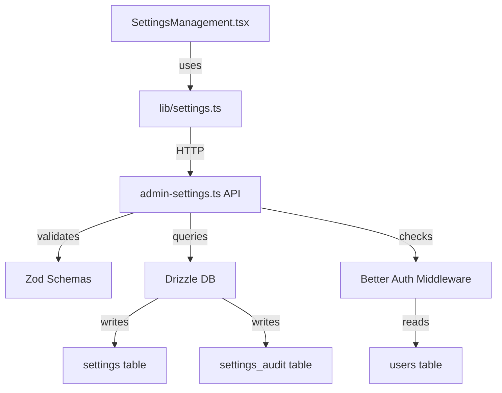

# Design Document

## Overview

The Admin Settings System provides a centralized interface for Black Living administrators to manage system configuration, user permissions, and operational settings. This design delivers a **simple, working MVP** that extends the existing [SettingsManagement.tsx](apps/admin/app/components/SettingsManagement.tsx) component with full backend functionality.

**Design Philosophy**: KISS (simple functions over service layers), YAGNI (implement only what's needed), DRY (reuse existing patterns), and pragmatic MVP approach (get it working first, optimize when proven necessary).

**Migration Context**: The frontend UI component already exists with full tab structure (permissions, website, payment, logistics, audit) and makes API calls to non-existent endpoints. This design focuses on implementing the missing backend infrastructure while maintaining API compatibility.

## Steering Document Alignment

### Technical Standards (tech.md)

The design follows Black Living's established technical patterns:

- **TypeScript-first development** with strict type checking across all layers
- **Zod schema validation** for runtime data validation on both frontend and backend
- **Drizzle ORM** with Cloudflare D1 for type-safe database operations using existing patterns (cuid2 IDs, timestamp mode)
- **Hono framework** for API development with middleware-based architecture
- **Better Auth** integration leveraging existing role-based access control (users.role column)
- **React with Shadcn/ui** components following established component patterns
- **Cloudflare Workers** deployment with D1 database backend

### Project Structure (structure.md)

The implementation follows the project's monorepo architecture:

- **Feature-based organization**: Settings functionality grouped in dedicated modules
- **Shared packages**: Types and schemas in `packages/types/`, database models in `packages/db/`
- **Clear separation of concerns**: API routes separate from business logic, frontend helpers separate from components
- **Consistent naming conventions**: kebab-case for files, PascalCase for components, camelCase for functions
- **Environment-specific configuration**: Development and production settings via wrangler.toml

**File locations**:
```
apps/admin/app/
├── components/SettingsManagement.tsx    # EXISTING - extend with validation
├── lib/settings.ts                      # NEW - API helper functions

apps/api/src/
├── modules/admin-settings.ts            # NEW - API routes
└── middleware/rbac.ts                   # EXISTING - reuse for permissions

packages/db/
├── schema.ts                            # UPDATE - add settings tables
└── migrations/NNNN_add_settings.sql     # NEW - migration file

packages/types/
└── settings.ts                          # NEW - shared TypeScript types
```

## Code Reuse Analysis

### Existing Components to Leverage

#### SettingsManagement.tsx Component
- **Current Implementation**: Fully structured React component with tabbed interface, form inputs, and API integration stubs
- **Reuse Strategy**: Keep existing UI structure, component hierarchy, and state management patterns
- **Integration Approach**: Replace placeholder fetch calls with helper functions, add Zod validation, handle placeholder responses for disabled features
- **Code Preservation**: No changes to UI layout, tab structure, or component composition - only enhance data handling

#### Better Auth System
- **Current Implementation**: Full authentication system with user roles stored in `users.role` column (customer, admin)
- **Reuse Strategy**: Extend role system to include granular admin roles (super_admin, admin, editor, viewer)
- **Integration Approach**: Use existing Better Auth middleware for session management, add role checks in API routes
- **Code Preservation**: No changes to auth flow or session handling

#### Database Schema Patterns
- **Current Implementation**: Drizzle ORM tables following consistent patterns (cuid2 IDs, timestamp mode, foreign key references)
- **Reuse Strategy**: Apply identical patterns to new settings tables for consistency
- **Integration Approach**: Use `createId()` for primary keys, `integer(..., { mode: 'timestamp' })` for dates, proper foreign key constraints
- **Code Preservation**: Maintain naming conventions and relationship patterns

#### API Module Structure
- **Current Implementation**: Hono apps in `apps/api/src/modules/` with route grouping and middleware
- **Reuse Strategy**: Create new admin-settings.ts module following existing patterns from products.ts and admin.ts
- **Integration Approach**: Use same middleware patterns, error handling, and response formats
- **Code Preservation**: Consistent with existing API architecture

### Integration Points

#### Frontend-Backend Communication
- **Existing Pattern**: React components use fetch with `credentials: 'include'`, environment-based API URLs
- **Integration Strategy**: Maintain exact API endpoint paths expected by SettingsManagement.tsx component
- **Data Flow**: Component → Helper Functions → API Routes → Database → Response transformation
- **Error Handling**: Toast notifications for user feedback, try-catch blocks with specific error messages

#### Database Integration
- **Existing Schema**: Users, sessions, accounts, products tables with established relationship patterns
- **Integration Strategy**: Add settings and settingsAudit tables following same conventions
- **Migration Approach**: Create backward-compatible migration, no changes to existing tables
- **Query Patterns**: Use Drizzle's query builder with typed results, leverage existing connection handling

#### Authentication Flow
- **Existing Middleware**: Better Auth provides session context in Hono routes via `c.get('session')`
- **Integration Strategy**: Add role-based middleware to settings routes checking for admin privileges
- **Permission Model**: Leverage existing role field without additional tables or complexity
- **Session Management**: No changes to existing session handling or token management

## Architecture

### System Architecture Overview

The Admin Settings System follows a three-tier architecture with clear separation of concerns:

**Presentation Layer** (React Components):
- SettingsManagement.tsx: Main container orchestrating all settings functionality
- Form components with inline validation and error display
- Tab-based navigation for different settings domains

**Application Layer** (API Routes):
- Hono routes handling HTTP requests with middleware
- Zod validation for incoming data
- Business logic for settings CRUD operations
- Audit logging for all changes

**Data Layer** (Database):
- Settings table: Key-value storage with namespace organization
- Settings audit table: Immutable log of all changes
- Users table: Existing table extended with admin roles

**Data Flow**:
```
User Action → Component → Helper Function → API Route → Middleware Check →
Database Query → Audit Log → Response → State Update → UI Render
```

### Modular Design Principles

#### Single File Responsibility
- **settings.ts**: Centralized API communication functions (load, save operations)
- **admin-settings.ts**: HTTP route handlers and request validation
- **settings.ts (types)**: TypeScript interfaces and Zod schemas
- **SettingsManagement.tsx**: UI orchestration and state management only

Each file handles one specific domain without cross-cutting concerns.

#### Component Isolation
- **Website Settings Form**: Self-contained form with validation for site information
- **Permissions Manager**: Independent table and role assignment UI
- **Audit Log Viewer**: Read-only display component with filtering
- **Tab Container**: Minimal orchestration logic, delegates to child components

Components communicate through props and callbacks, no shared mutable state.

#### Service Layer Separation
- **Data Access**: Direct Drizzle queries in API routes (no separate repository layer for simplicity)
- **Business Logic**: Validation and transformation in API handlers
- **Presentation Logic**: React components handle UI concerns only
- **No Service Classes**: Simple exported functions instead of class-based services (KISS principle)

Deliberate choice to avoid over-abstraction for a system with 2-10 changes per month.



## Components and Interfaces

### SettingsManagement Component (Frontend)
- **Purpose**: Main container component managing tabbed settings interface and coordinating all settings operations
- **Interfaces**:
  - Props: `initialData?: SettingsData`, `onSettingsChange?: (changes) => void`
  - State: Tab selection, loading states, form data for each settings domain
  - Events: Tab changes, form submissions, data refreshes
- **Dependencies**: React hooks (useState, useEffect), UI components (Card, Tabs, Input, Button), helper functions from lib/settings.ts, toast notifications
- **Reuses**: Existing Shadcn/ui components, established form patterns, environment context for API URLs

### WebsiteSettings API Handler (Backend)
- **Purpose**: Handle CRUD operations for website configuration (title, contact info, business hours, social links)
- **Interfaces**:
  - `GET /api/admin/settings/website` → `{ data: WebsiteSettings }`
  - `PUT /api/admin/settings/website` + body: WebsiteSettings → `{ success: boolean }`
- **Dependencies**: Hono context, Drizzle DB instance, Zod validator middleware, Better Auth session
- **Reuses**: Existing middleware patterns, database query utilities, error response formats

### PermissionsManager API Handler (Backend)
- **Purpose**: Manage admin user roles and permissions with audit trail
- **Interfaces**:
  - `GET /api/admin/settings/admin-users` → `{ data: AdminUser[] }`
  - `PUT /api/admin/settings/admin-users/:userId/role` + body: `{ role }` → `{ success: boolean }`
  - `DELETE /api/admin/settings/admin-users/:userId` → `{ success: boolean }`
- **Dependencies**: Hono routing, Drizzle DB, audit logging function, role validation
- **Reuses**: Existing user table structure, auth middleware, audit patterns

### AuditLog API Handler (Backend)
- **Purpose**: Retrieve filtered audit logs with user information joined
- **Interfaces**:
  - `GET /api/admin/settings/audit-logs?limit=N` → `{ data: AuditLog[] }`
- **Dependencies**: Drizzle query builder, join operations, timestamp ordering
- **Reuses**: Existing pagination patterns, query result transformation

### Settings Helper Functions (Frontend)
- **Purpose**: Centralized API communication layer abstracting fetch calls
- **Interfaces**:
  - `loadWebsiteSettings(): Promise<WebsiteSettings>`
  - `saveWebsiteSettings(settings: WebsiteSettings): Promise<void>`
  - `loadAdminUsers(): Promise<AdminUser[]>`
  - `updateUserRole(userId: string, role: AdminUser['role']): Promise<void>`
  - `removeAdminUser(userId: string): Promise<void>`
  - `loadAuditLogs(limit?: number): Promise<AuditLog[]>`
- **Dependencies**: Fetch API, environment configuration, TypeScript types
- **Reuses**: Existing API communication patterns, error handling conventions

### Placeholder Feature Handlers (Backend)
- **Purpose**: Return appropriate responses for disabled payment/logistics features per requirements
- **Interfaces**:
  - `GET /api/admin/settings/payment` → `{ status: 'placeholder', readonly: true, message: '功能尚未開放（即將推出）', data: null }`
  - `PUT /api/admin/settings/payment` → `403 { code: 'FEATURE_DISABLED', message: '此功能尚未開放' }`
  - Same pattern for `/logistics` endpoints
- **Dependencies**: None (static responses)
- **Reuses**: Standard error response format

## Data Models

### Settings Table
```typescript
// packages/db/schema.ts
export const settings = sqliteTable('settings', {
  id: text('id').primaryKey().$defaultFn(() => createId()),
  namespace: text('namespace').notNull(), // 'website', 'payments', 'logistics'
  key: text('key').notNull(),
  valueJson: text('value_json', { mode: 'json' }).notNull(),
  updatedBy: text('updated_by').references(() => users.id),
  updatedAt: integer('updated_at', { mode: 'timestamp' }).$defaultFn(() => new Date()),
}, (table) => ({
  namespaceKeyIdx: unique().on(table.namespace, table.key),
}));
```

**Design Rationale**:
- **Namespace organization**: Groups related settings (website, payments, logistics) without separate tables
- **JSON storage**: Flexible value storage with type safety enforced at application layer via Zod
- **Unique constraint**: Prevents duplicate settings entries for same namespace+key combination
- **Audit trail**: updatedBy and updatedAt track last modification without version complexity
- **Simplified schema**: No version field, hash chaining, or optimistic locking (2-10 changes/month doesn't warrant this complexity)

### Settings Audit Table
```typescript
export const settingsAudit = sqliteTable('settings_audit', {
  id: text('id').primaryKey().$defaultFn(() => createId()),
  namespace: text('namespace').notNull(),
  key: text('key').notNull(),
  oldValueJson: text('old_value_json', { mode: 'json' }),
  newValueJson: text('new_value_json', { mode: 'json' }).notNull(),
  actedBy: text('acted_by').notNull().references(() => users.id),
  actedAt: integer('acted_at', { mode: 'timestamp' }).$defaultFn(() => new Date()),
  ipAddress: text('ip_address'),
  action: text('action').notNull(), // 'update', 'delete', 'view_placeholder', 'role_change'
});
```

**Design Rationale**:
- **Immutable log**: Append-only table capturing all changes for compliance
- **Before/after values**: oldValueJson and newValueJson enable change tracking and potential rollback
- **Actor tracking**: actedBy links to users table for accountability
- **IP logging**: Captures request origin for security auditing
- **Action types**: Explicit action field for filtering different operation types
- **No hash chaining**: Removed prevHash/hash complexity - not needed for low-frequency changes

### WebsiteSettings Type
```typescript
// packages/types/settings.ts
export const websiteSettingsSchema = z.object({
  siteTitle: z.string().min(1).max(100),
  siteDescription: z.string().max(500).optional(),
  contactEmail: z.string().email(),
  contactPhone: z.string().optional(),
  businessHours: z.string().optional(),
  address: z.string().optional(),
  socialLinks: z.object({
    facebook: z.string().url().optional(),
    instagram: z.string().url().optional(),
    line: z.string().optional(),
  }).optional(),
});

export type WebsiteSettings = z.infer<typeof websiteSettingsSchema>;
```

**Design Rationale**:
- **Zod-first**: Schema serves both validation and TypeScript type generation
- **Required fields**: Only siteTitle and contactEmail are mandatory for MVP
- **Validation rules**: Email format, URL format, max lengths prevent invalid data
- **Optional fields**: Flexible schema allows gradual completion

### AdminUser Type
```typescript
export interface AdminUser {
  id: string;
  email: string;
  name: string;
  role: 'super_admin' | 'admin' | 'editor' | 'viewer';
  createdAt: Date;
}
```

**Design Rationale**:
- **Extends existing users table**: No new table needed, uses existing schema
- **Role enumeration**: Explicit allowed values prevent typos and invalid roles
- **Minimal fields**: Only includes what UI needs for display and updates

### AuditLog Type
```typescript
export interface AuditLog {
  id: string;
  userId: string;
  userEmail: string;
  action: string;
  resource: string;
  oldValue?: any;
  newValue?: any;
  timestamp: Date;
  ipAddress: string;
}
```

**Design Rationale**:
- **Joined data**: Includes userEmail from join with users table for display
- **Resource string**: Formatted as "namespace:key" for easy filtering
- **Flexible values**: any type for oldValue/newValue since different settings have different structures

## Error Handling

### Error Scenarios

#### 1. Validation Errors
- **Scenario**: User submits invalid email format in contact settings, or URL without protocol in social links
- **Handling**:
  - Frontend: Zod validation before submission, inline error messages with specific field highlighting
  - Backend: Re-validation with same Zod schema, return 400 with field-level errors
- **User Impact**: Form shows red borders on invalid fields with clear error text ("請輸入有效的電子郵件地址"), submit button disabled until valid

#### 2. Permission Errors
- **Scenario**: Non-admin user attempts to access settings API, or admin tries to modify super_admin role without sufficient privileges
- **Handling**: Better Auth middleware intercepts at route level, checks `session.user.role`, returns 403 before business logic
- **User Impact**: Redirect to login page if not authenticated, or "權限不足" error message if insufficient role

#### 3. Network Errors
- **Scenario**: API request fails due to connectivity issues, timeout, or server unavailable
- **Handling**:
  - Try-catch blocks around fetch calls in helper functions
  - Toast notification with retry option
  - Component remains in loading state or shows cached data
- **User Impact**: "網路連線失敗，請稍後再試" toast notification, ability to manually retry via refresh button

#### 4. Concurrency Conflicts
- **Scenario**: Two admins modify same setting simultaneously (edge case given 2-10 changes/month frequency)
- **Handling**:
  - MVP: Last write wins (simple approach for low frequency)
  - Future: Add version field and optimistic locking if needed
  - Display warning: "設定可能已被其他管理員更新，請重新載入"
- **User Impact**: Second save succeeds but may overwrite first change, notification suggests refreshing to see current state

#### 5. Feature Disabled Errors
- **Scenario**: User attempts to modify payment or logistics settings when features are disabled via feature flags
- **Handling**:
  - GET: Return 200 with placeholder response `{ status: 'placeholder', readonly: true, message: '功能尚未開放（即將推出）', data: null }`
  - PUT: Return 403 with `{ code: 'FEATURE_DISABLED', message: '此功能尚未開放' }`
  - Frontend: Detect placeholder status and disable form inputs, show read-only message
- **User Impact**: Grayed out form with Traditional Chinese message explaining feature coming soon

#### 6. Database Errors
- **Scenario**: D1 database query fails, constraint violation, or connection timeout
- **Handling**:
  - Catch database errors in API handler
  - Log error details server-side for debugging
  - Return generic 500 error to client to avoid exposing internals
- **User Impact**: "儲存失敗，請稍後再試" message, changes not persisted, rollback transaction

## Testing Strategy

### Unit Testing

**Zod Schema Validation**:
- Test `websiteSettingsSchema` rejects invalid emails (missing @, invalid domain)
- Test URL validation for social links rejects malformed URLs
- Test max length constraints on siteTitle (100 chars) and siteDescription (500 chars)
- Test optional field handling (undefined vs empty string)

**Helper Functions**:
- Test `loadWebsiteSettings()` correctly parses API response to WebsiteSettings type
- Test `saveWebsiteSettings()` throws error on non-2xx response
- Test error message extraction from failed API calls
- Mock fetch globally to avoid actual network calls

**Utility Functions**:
- Test date formatting for audit log timestamps (zh-TW locale)
- Test namespace+key concatenation for audit resource strings
- Test role hierarchy checking (super_admin > admin > editor > viewer)

### Integration Testing

**API Endpoint Testing** (using Vitest with mock D1 database):

**Website Settings CRUD**:
- POST valid website settings → verify saved to database with correct namespace/key
- POST invalid settings (bad email) → receive 400 with field errors
- GET website settings → receive transformed object (not raw database rows)
- PUT updates existing settings → verify upsert behavior (insert or update)
- Verify audit log created with oldValue/newValue after update

**Permissions Management**:
- GET admin users → returns only users with admin roles (filters out customers)
- PUT role change with super_admin session → succeeds and creates audit log
- PUT role change with regular admin → fails with 403 when targeting super_admin
- DELETE admin user → reverts role to 'customer', doesn't delete user record
- Verify audit logging for all permission changes

**Disabled Features**:
- GET payment settings → returns placeholder response with status field
- PUT payment settings → returns 403 with FEATURE_DISABLED code
- GET logistics settings → returns placeholder response
- PUT logistics settings → returns 403 with FEATURE_DISABLED code

**Audit Logs**:
- GET audit logs → returns sorted by actedAt DESC
- GET with limit parameter → respects limit (default 50, custom values)
- Verify joined userEmail appears in results
- Verify namespace:key formatting in resource field

**Authentication & Authorization**:
- All endpoints without session → 403 Unauthorized
- Endpoints with customer role → 403 Unauthorized
- Endpoints with admin role → 200 Success
- Endpoints with super_admin role → 200 Success

### End-to-End Testing

**E2E Scenario 1: Update Website Settings**:
1. Login as admin user via Better Auth
2. Navigate to /admin/settings page
3. Click "網站設定" tab
4. Update site title to "Black Living 寢具精品 - 測試"
5. Update contact email to "test@blackliving.com.tw"
6. Click "儲存設定" button
7. Verify success toast appears: "網站設定已儲存"
8. Navigate to "稽核日誌" tab
9. Verify audit log entry shows: action="update", resource="website:siteTitle", newValue matches input

**E2E Scenario 2: Manage User Permissions**:
1. Login as super_admin user
2. Navigate to "權限管理" tab
3. Find test user in admin users table
4. Change role dropdown from "viewer" to "admin"
5. Verify confirmation dialog appears
6. Click "確認" button
7. Verify success toast: "使用者權限已更新"
8. Verify role dropdown now shows "admin"
9. Navigate to audit logs
10. Verify audit log entry: action="role_change", resource="permissions:user:{userId}:role"

**E2E Scenario 3: Disabled Feature Handling**:
1. Login as admin user
2. Navigate to "支付設定" tab
3. Verify form inputs are disabled/grayed out
4. Verify message displayed: "功能尚未開放（即將推出）"
5. Verify save button is disabled with tooltip "即將推出"
6. Attempt to submit form via browser devtools (bypass UI)
7. Verify 403 error returned
8. Verify error toast: "此功能尚未開放"

**E2E Scenario 4: Permission Denial**:
1. Login as user with customer role
2. Attempt to navigate to /admin/settings
3. Verify redirect to login or access denied page
4. Login as admin user
5. Successfully access settings page
6. Verify tabs load without errors

**E2E Scenario 5: Mobile Responsiveness**:
1. Access settings page on mobile viewport (375px width)
2. Verify tab navigation is touch-friendly
3. Verify forms are scrollable and inputs accessible
4. Verify tables have horizontal scroll for overflow content
5. Verify modals/dialogs center correctly on small screens

