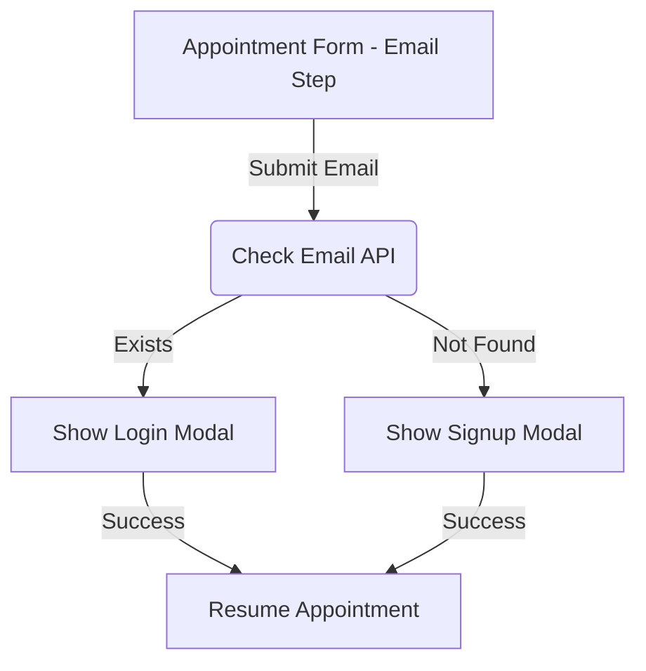

# Design Document

## Overview

The Appointment Flow Simplification feature aims to streamline the booking process by introducing an intelligent email check and a simplified authentication flow. Instead of relying solely on magic links, the system will verify if a user exists. Existing users will be prompted to log in (supporting password or magic link), while new users will be presented with a modal to create an account without leaving the appointment flow. This reduces friction and improves the user experience.

## Steering Document Alignment

### Technical Standards (tech.md)
- **API Design**: Follows the Hono framework patterns in `apps/api`. New endpoints will be added to `auth.ts` and `customers.ts` (or a new module if needed) adhering to existing validation and error handling standards.
- **Database**: Uses Drizzle ORM and existing `users` and `userSecurity` tables. No new tables are strictly required, but we will leverage `userSecurity` for password auth.
- **Frontend**: Uses React components within Astro pages (`MultiStepAppointmentForm`), maintaining the existing component architecture and state management via Zustand (`appointmentStore`, `authStore`).

### Project Structure (structure.md)
- **API**: New endpoints in `apps/api/src/modules/auth.ts` (or `users.ts`).
- **UI**: Updates to `apps/web/src/components/appointment/MultiStepAppointmentForm.tsx` and creation of new modals in `apps/web/src/components/auth/`.
- **State**: Updates to `apps/web/src/stores/authStore.ts` to handle the new flow.

## Code Reuse Analysis

### Existing Components to Leverage
- **`MultiStepAppointmentForm.tsx`**: The core appointment flow component. We will inject the check logic here.
- **`MagicLinkModal.tsx`**: Can be adapted or replaced by a more generic `AuthModal.tsx` that supports tabs for Login/Signup.
- **`useAuthStore`**: Existing auth state management.
- **`users` and `userSecurity` tables**: Existing schema for user data and passwords.

### Integration Points
- **`POST /auth/initiate`**: Existing magic link endpoint.
- **`POST /api/customers`**: Existing admin endpoint, but we need a public "register" endpoint.

## Architecture

The architecture follows the client-server model where the frontend orchestrates the flow based on API responses.



## Components and Interfaces

### Component 1: Auth API (`apps/api/src/modules/auth.ts`)
- **Purpose**: Handle email verification and authentication.
- **Interfaces**:
  - `POST /auth/check-email`: `{ email: string } -> { exists: boolean }`
  - `POST /auth/login`: `{ email: string, password: string } -> { token: string, user: User }` (New)
  - `POST /auth/register`: `{ email: string, password: string, name: string, phone: string } -> { token: string, user: User }` (New)
- **Dependencies**: `users` table, `userSecurity` table, `bcrypt` (or similar for hashing).

### Component 2: Auth Modal (`apps/web/src/components/auth/AuthModal.tsx`)
- **Purpose**: A unified modal for Login and Signup.
- **Interfaces**:
  - Props: `isOpen`, `onClose`, `initialEmail`, `mode` ('login' | 'signup'), `onSuccess`
- **Dependencies**: `useAuthStore`
- **Reuses**: `Dialog` or `Modal` components from UI library.

### Component 3: Appointment Form Logic (`MultiStepAppointmentForm.tsx`)
- **Purpose**: Orchestrate the flow.
- **Changes**:
  - In `PersonalInfoStep`, when "Next" is clicked:
    1. Call `checkEmail(email)`.
    2. If exists -> Open `AuthModal` (Login mode).
    3. If not -> Open `AuthModal` (Signup mode).
    4. On success -> Proceed to `DateTimeStep`.

## Data Models

No new database tables are required. We will use the existing `users` and `userSecurity` tables.

### User Security (Existing)
```typescript
export const userSecurity = sqliteTable('user_security', {
  userId: text('user_id').references(() => users.id),
  passwordHash: text('password_hash'),
  // ...
});
```

## Error Handling

### Error Scenarios
1. **Email Check Failed**: API error.
   - **Handling**: Show generic error message, allow retry.
   - **User Impact**: User cannot proceed.
2. **Login Failed**: Wrong password.
   - **Handling**: Show "Invalid credentials" in modal.
   - **User Impact**: User tries again or uses "Forgot Password" (magic link).
3. **Registration Failed**: Email taken (race condition) or invalid data.
   - **Handling**: Show specific error.
   - **User Impact**: User corrects data.

## Testing Strategy

### Unit Testing
- Test `checkEmail` API logic.
- Test `register` and `login` API logic (hashing, token generation).
- Test `AuthModal` state transitions.

### Integration Testing
- Test the full flow: Enter email -> Check -> Register -> Auto-login -> Resume appointment.
- Test Login flow: Enter email -> Check -> Login -> Resume.

### End-to-End Testing
- Use Playwright to simulate a new user booking an appointment.
- Use Playwright to simulate an existing user booking.