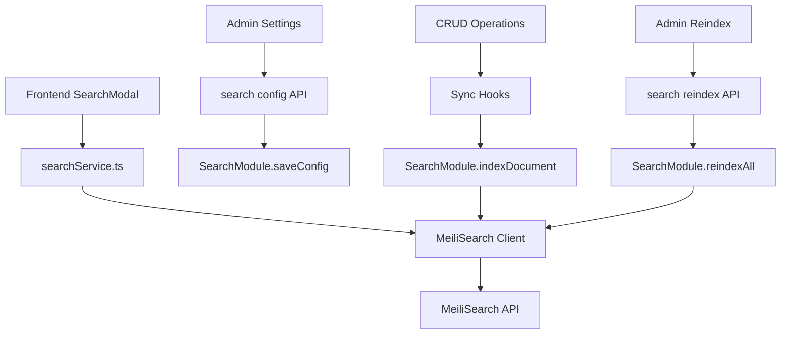

# Design Document

## Overview

The MeiliSearch integration replaces the current D1 SQL LIKE queries with a dedicated search engine to provide fast, typo-tolerant, and unified search across Products, Blog Posts, and Static Pages. This feature achieves sub-50ms response times while maintaining the existing Cmd+K modal interface and adding enhanced search capabilities including autocomplete, faceted filtering, and analytics.

## Steering Document Alignment

### Technical Standards (tech.md)
The design follows established patterns in the Black Living e-commerce platform:
- **API Architecture**: Hono-based modules with TypeScript interfaces
- **Data Storage**: Cloudflare D1 with Drizzle ORM for primary data, Cloudflare KV for configuration
- **Frontend State**: Zustand stores with React hooks
- **Error Handling**: Centralized error utilities with proper HTTP status codes
- **Authentication**: Admin-only endpoints using existing auth middleware

### Project Structure (structure.md)
The implementation follows the monorepo structure:
- **Backend**: `apps/api/src/modules/` for business logic, `apps/api/src/routes/` for HTTP endpoints
- **Frontend**: `apps/web/src/services/` for API clients, `apps/web/src/stores/` for state management
- **Admin**: `apps/admin/app/routes/` for pages, `apps/admin/app/services/` for API calls
- **Shared**: Workspace packages for types, database schemas, and UI components

## Code Reuse Analysis

### Existing Components to Leverage
- **Hono App Pattern**: `apps/api/src/modules/products.ts` - Reusable for SearchModule structure
- **KV Storage**: `apps/api/src/lib/storage.ts` - For configuration storage (abstracts KV/D1 access)
- **Cache Layer**: `apps/api/src/lib/cache.ts` - For search result caching
- **Auth Middleware**: `apps/api/src/middleware/auth.ts` - For admin-only endpoints
- **Search Store**: `apps/web/src/stores/searchStore.ts` - Will be extended for MeiliSearch results
- **Search Service**: `apps/web/src/services/searchService.ts` - Will be updated to use MeiliSearch client

### Integration Points
- **Database**: Products, posts, pages tables via existing Drizzle schemas
- **Cache**: Cloudflare KV for search configuration and result caching
- **Storage**: Cloudflare R2 (not directly used but follows same patterns)
- **Authentication**: Admin routes for configuration management
- **Frontend**: Existing SearchModal component and Cmd+K shortcut handling
- **Shared Types**: `packages/types` for defining `SearchDocument` and `SearchConfig` interfaces

## Architecture

The design implements a modular search service architecture with clear separation of concerns:

### Modular Design Principles
- **Single File Responsibility**: Each module handles one aspect (config, indexing, search)
- **Component Isolation**: SearchModule, sync utilities, and frontend service are independent
- **Service Layer Separation**: Backend indexing, frontend querying, admin configuration
- **Utility Modularity**: Content transformation utilities are focused and reusable



## Components and Interfaces

### SearchModule (Backend)
- **Purpose:** Centralized MeiliSearch client and operations
- **Interfaces:**
  - `saveConfig(host: string, masterKey: string): Promise<void>`
  - `getConfig(): Promise<{host: string, searchKey: string}>`
  - `reindexAll(): Promise<{indexed: number, errors: string[]}>`
  - `indexDocument(type: string, data: any): Promise<void>`
  - `deleteDocument(type: string, id: string): Promise<void>`
- **Dependencies:** MeiliSearch client, KV/D1 storage, existing cache utilities
- **Reuses:** Existing error handling patterns, storage abstractions

### Search Sync Utilities
- **Purpose:** Transform content into MeiliSearch document format
- **Interfaces:**
  - `transformProduct(product: Product): SearchDocument`
  - `transformPost(post: Post): SearchDocument`
  - `transformPage(page: Page): SearchDocument`
- **Dependencies:** Existing data models, HTML sanitization utilities
- **Reuses:** Content processing patterns from existing modules

### Frontend Search Service
- **Purpose:** Query MeiliSearch with unified search interface
- **Interfaces:**
  - `fetchUnifiedSearch(query: string, filters?: any): Promise<SearchResult[]>`
  - `fetchAutocomplete(query: string): Promise<string[]>`
- **Dependencies:** MeiliSearch client, existing search store
- **Reuses:** Existing search service patterns and error handling

### Admin Configuration UI
- **Purpose:** Manage MeiliSearch settings through admin interface
- **Interfaces:** Form components for host URL and API keys
- **Dependencies:** Existing admin UI patterns, API service layer
- **Reuses:** Settings page structure, form validation patterns

### Analytics Service
- **Purpose:** Track search metrics (queries, clicks, zero results)
- **Interfaces:**
  - `trackSearch(query: string, resultsCount: number): void`
  - `trackClick(query: string, documentId: string): void`
- **Implementation:** Frontend sends events to `apps/api` or directly to MeiliSearch (if using Cloud) / Analytics provider.
- **Decision:** Use a lightweight `/api/analytics/search` endpoint in `apps/api` to log to D1/KV for simple internal analytics, or integrate with PostHog/Google Analytics. *Decision: Log to D1 via API for privacy-focused, self-hosted metrics.*

## Data Models

### SearchDocument (MeiliSearch Index)
*Location: `packages/types/src/search.ts`*
```
interface SearchDocument {
  id: string;              // "product_123", "post_456", "page_789"
  type: "product" | "post" | "page";
  title: string;           // Product/post/page title
  slug: string;            // URL slug
  description: string;     // Truncated description/content
  content: string;         // Full searchable content (HTML stripped)
  image?: string;          // Primary image URL
  category?: string;       // Product category or content category
  tags: string[];          // Associated tags
  updatedAt: string;       // ISO timestamp
  // Product-specific fields
  price?: number;          // For products
  inStock?: boolean;       // For products
  // Content-specific fields
  published?: boolean;     // For posts/pages
  author?: string;         // For posts
}
```

### Search Configuration
*Location: `packages/types/src/search.ts`*
```
interface SearchConfig {
  host: string;            // "https://meilisearch.anlstudio.cc"
  masterKey: string;       // Admin key for indexing
  searchKey: string;       // Public key for searching
  indexName: string;       // "blackliving_content"
}
```

## Error Handling

### Error Scenarios

1. **MeiliSearch Unavailable**
   - **Handling:** Graceful fallback to D1 LIKE search with user notification
   - **User Impact:** Slower search results with "Search temporarily limited" message

2. **Indexing Failures**
   - **Handling:** Log errors, retry with exponential backoff, alert admin via logs
   - **User Impact:** Content may not appear in search until next successful sync

3. **Configuration Invalid**
   - **Handling:** Validate on save, show clear error messages in admin UI
   - **User Impact:** Admin cannot save invalid configuration

4. **Search Key Missing**
   - **Handling:** Frontend falls back to cached results or shows error
   - **User Impact:** Search unavailable until configuration is fixed

## Testing Strategy

### Unit Testing
- SearchModule methods with mocked MeiliSearch client
- Content transformation utilities with various input formats
- Frontend search service with mock responses
- Configuration validation and error handling

### Integration Testing
- End-to-end indexing workflow (CRUD → MeiliSearch sync)
- Search configuration API endpoints
- Frontend-backend search flow with real MeiliSearch instance
- Admin configuration UI with API integration

### End-to-End Testing
- Complete user search journey from Cmd+K to results
- Admin configuration and reindexing workflow
- Content creation/update with automatic indexing
- Search performance validation (response time < 100ms)
- Graceful degradation when MeiliSearch is unavailable